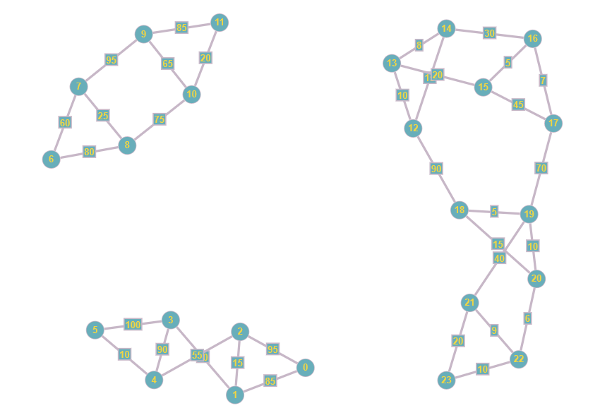

# Estrutura de Dados e Análise de Algoritmos
##### Otimização Logística com Múltiplos Centros de Distribuição 


## Time

| Nome                             |RA         |
| ---------------------------------| --------- |
| Bruno Costa Carvalho             | 821116933 |
| Erik Akio Matsumoto              | 821115561 |
| Gabriel Guardiano do Nascimento  | 821145633 |
| Mariana de Moraes Marcondes      | 821116771 |
| Renan Moura Silva                | 821145633 |
| Vinícius Peralta                 | 821222997 |


## Objetivo

Desenvolver um algorítmo que otimize o roteamento de entregas entre centros de distribuição e cidades próximas, considerando a capacidade dos caminhões, prioridade das entregas, e distâncias entre locais, para minimizar o tempo e a distância percorrida.

## Parâmetros Utilizados

- 2 Caminhões por centro (Truck e Toco), com 14 e 8 toneladas cada, respectivamente.
- Os motoristas dirigem em uma velocidade média de 70 km/h por 10 horas diárias.
- Entregas de com prioridade e com o prazo de entrega do mesmo dia devem ser enviadas através do caminhão toco.
- É gerado um grafo para cada centro de distribuição, considerando as cidades de destino.
- O algoritmo de Dijkstra com multiplas paradas é utilizado para gerar a ordem das entregas com base na distância e prioridade.
- Utilizamos o Heap para garantir uma execução mais otimizada do código.
- Cria uma matriz de adjancencia com base no grafo principal para melhor visualização.




## Uso / Exemplo
Para facilitar o input, para referenciar cada cidade, deve ser colocado apenas a primeira letra seguido do seu número, por exemplo:

Curitiba 3

```sh
C3
```

O mesmo para todas as cidades (Belém 1 -> B1, Recife 2 -> B2, Curitiba 3 -> C3 e São Paulo 4 -> S4)

Após isso basta o input é bem intuitivo, basta digitar o peso (tipo float), depois S/N para definir a prioridade e depois S/N para colocar mais cidades de destino.


## Matriz Adjacência
O arquivo: `matrizAdjacencia.py` apenas gera uma matriz de adjacência do grafo localizado dentro de `/data/dicionarioGrafo.py`.